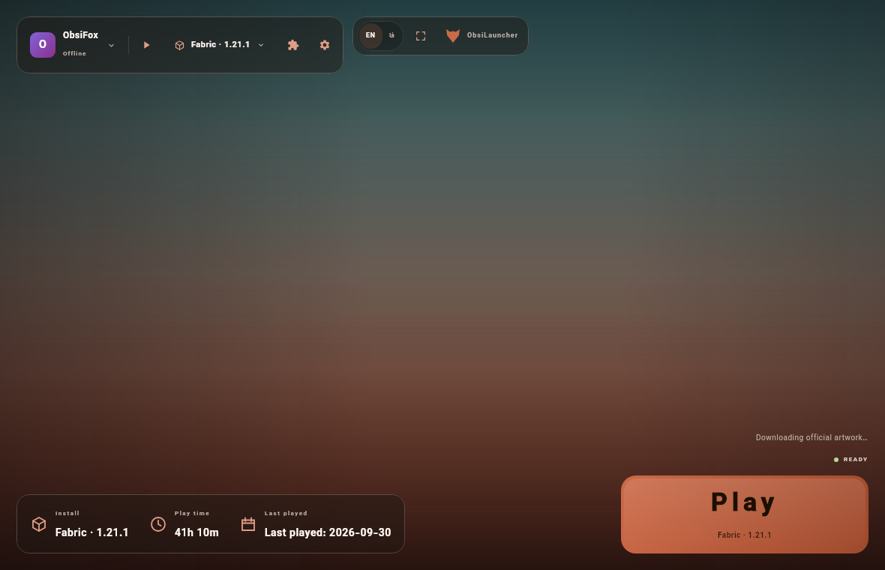
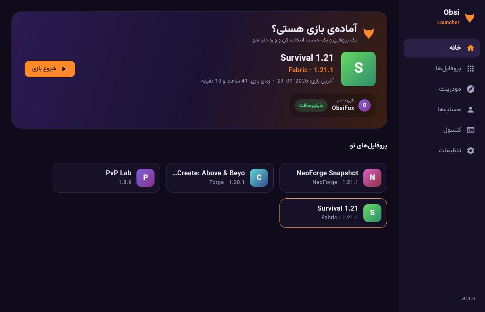
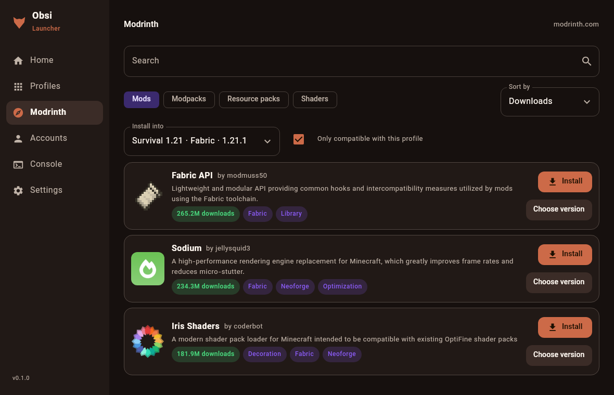
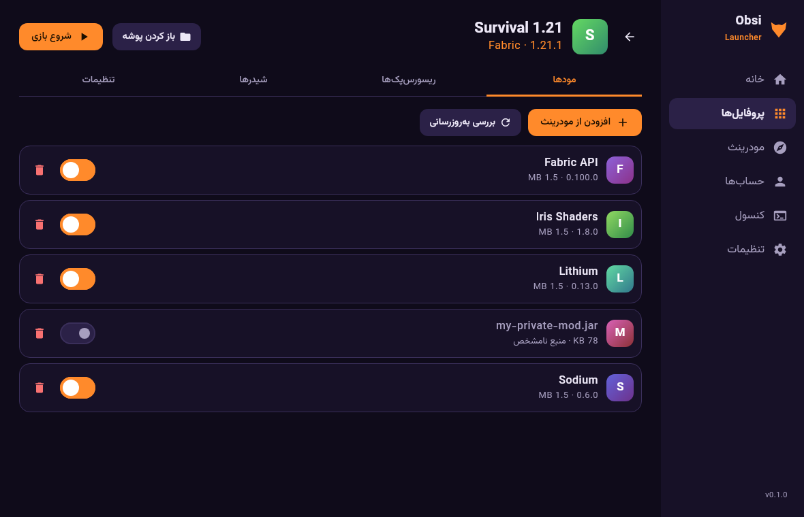

<p align="center"></p>

<h1 align="center">ObsiLauncher</h1>
<p align="center">A multi-profile launcher for <b>Minecraft: Java Edition</b> with built-in Modrinth, for <b>Android</b>, <b>Windows</b> and <b>Linux</b>.</p>
<p align="center"><a href="README.fa.md">فارسی</a></p>

> Private repository · version `0.1.0` (MVP). *Not affiliated with Mojang AB or Microsoft.*

## What you get

| | Android | Windows / Linux |
|---|---|---|
| Based on | ZalithLauncher2 `2.6.1` (GPL-3.0), rebranded by an overlay | Written from scratch (Kotlin + Compose Multiplatform) |
| Profiles (instances), each with its own mods/saves/settings | ✔ | ✔ |
| Vanilla, Fabric, Quilt, Forge, NeoForge | ✔ | ✔ (auto-installed) |
| Microsoft account + offline account | ✔ | ✔ (device-code sign-in) |
| Modrinth: search, install with dependencies, update check, `.mrpack` modpacks | ✔ | ✔ |
| Java runtime | bundled | downloaded from Mojang automatically |
| UI languages | EN + notice card in FA | **EN + FA (RTL, Vazirmatn font)** |
| Extras | renderers, controls, … (upstream) | live game console, crash dialog, BMCLAPI mirror + proxy, per-profile memory/JVM args/resolution/auto-join |

## Screenshots

| English (LTR) | فارسی (RTL) |
|---|---|
|  |  |
|  |  |

## Download

CI builds are published in the **[nightly pre-release](../../releases/tag/nightly)** (private repo → you must be logged in):

* `ObsiLauncher-<ver>-zl2.6.1-arm64-v8a.apk` – Android 8.0+ (arm64)
* `ObsiLauncher-<ver>-windows-x64.msi` or `…-portable.zip`
* `ObsiLauncher-<ver>-linux-x64.deb` or `…-portable.tar.gz`

Install on Linux with `sudo apt install ./ObsiLauncher-<ver>-linux-x64.deb` (tested on Debian 13; the dependency list also accepts the older library names of Debian 12 / Ubuntu 22.04, which were not tested), or unpack the portable archive anywhere and run `ObsiLauncher/bin/ObsiLauncher`. On Windows run the `.msi`, or unzip the portable archive and start `ObsiLauncher.exe`.

Run **Actions → Android / Desktop → Run workflow** to produce fresh ones. See [docs/SETUP.md](docs/SETUP.md) for the optional secrets (Microsoft sign-in needs your own Azure app ID).

## Repository layout

```
core/      platform-independent Kotlin/JVM engine: Mojang manifests, downloads, Java runtimes, loaders,
           Modrinth, accounts, launch command builder, headless CLI + tests
desktop/   Compose Multiplatform UI (Windows/Linux) + jpackage config
android/   overlay + scripts that turn pinned ZalithLauncher2 into ObsiLauncher at CI time
tools/     icon generator
docs/      SETUP.md, ARCHITECTURE.md
.github/   workflows (manual / tag-triggered only) + publish script
```

Architecture notes: [docs/ARCHITECTURE.md](docs/ARCHITECTURE.md). Licensing: [NOTICE.md](NOTICE.md).

## Build locally

```bash
./gradlew :core:test                    # offline unit tests
./gradlew :desktop:run                  # start the desktop launcher (JDK 21)
./gradlew :desktop:createDistributable  # portable app image in desktop/build/compose/binaries
```
The Android APK is built in CI (it needs the Android SDK/NDK and ~1 GB of upstream runtimes): `bash android/scripts/prepare.sh && cd android/.work/upstream && ./gradlew ZalithLauncher:assembleRelease -Darch=arm64`.

## Status & what has actually been tested

**Desktop engine (Linux, CI + a virtual display).** Real installs *and* real game start-ups were run through the same code the GUI uses:

| Loader | Minecraft versions started |
|---|---|
| Vanilla | 1.7.10, 1.8.9, 1.13.2, 1.17.1, 1.18.2, 1.19.4, 1.21.1 |
| Fabric | 1.16.5, 1.19.4, 1.21.1, 26.2 (a 49-mod Modrinth modpack installed from `.mrpack`) |
| Forge | 1.12.2, 1.16.5, 1.18.2, 1.20.1 |
| NeoForge | 1.20.4, 1.21.1 |

"Started" = the game reached its own window / OpenGL initialisation (on a machine with a display it creates textures and shows the title screen).
The packaged Linux app was also driven through its GUI: *Play → live console → Minecraft title screen → Kill*.
Modrinth search, version pick, dependency install (Iris → Sodium), update check and `.mrpack` import were run against the live API.
Offline unit tests cover resolver, rules, launch command, UUIDs, log parsing, version ordering and EN/FA string completeness.

**Not verified / limits**

* **Microsoft login is disabled until you add `MS_CLIENT_ID` and Mojang approves it** ([docs/SETUP.md](docs/SETUP.md)); the device-code request was checked against Microsoft (errors are reported correctly) but a real sign-in could not be tested. Offline accounts work now.
* **Windows** packages (`.msi`, portable `.zip`) are built by CI but were not run on a real Windows PC. The `.msi` is unsigned, so SmartScreen will warn.
* **Android**: the APK builds, is correctly signed and its manifest/strings were inspected, but it was not installed on a device here.
* **Quilt**: installs and starts its loader, but its first-run remap is so slow on the 2-core test box that a full start-up was not confirmed.
* Account tokens are stored in `accounts.json` (owner-only permissions on Linux) like most launchers; OS keychain integration is future work.
* Not yet: CurseForge on desktop, skins, server list, instance export, macOS packaging, a full Persian translation of the Android app.
